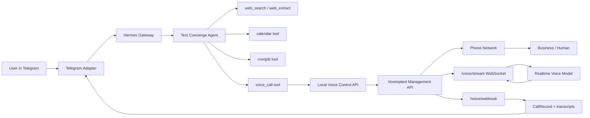
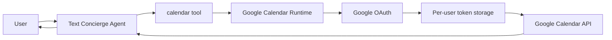
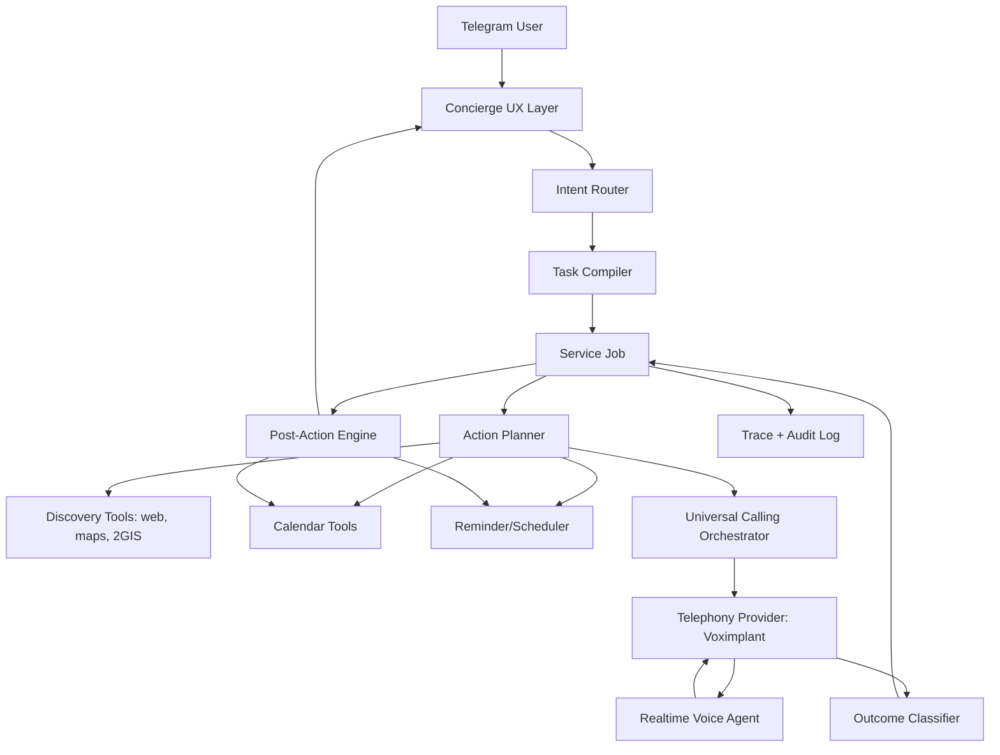

# Universal Calling Product Blueprint

## Problem Definition

The exact problem we are solving:

Users do not want "a chatbot". They want practical outcomes that currently require messy human coordination: call a restaurant, book a table, check availability, move an appointment, confirm details, ask a clinic a question, find a working phone number, wait on hold, and report back cleanly.

The product wedge is universal calling: a concierge that can convert a short Telegram request into a completed real-world phone task. Search, calendar, reminders, and recommendations are supporting capabilities. The call is the main handle.

If this works reliably, it disrupts a huge class of personal assistant, booking, scheduling, and local-service workflows because the user no longer adapts to each business's software stack. The assistant talks to the world through the most universal API businesses already have: the phone.

## Product Thesis

The user should be able to write:

```text
Забронируй Sage завтра на 21:00 на троих на имя Цева
```

And the system should:

- find or confirm the right venue and phone number;
- infer the missing operational details if safe;
- call the venue;
- handle the conversation naturally;
- confirm the booking or return alternatives;
- optionally add the event to calendar;
- remind the user before the event;
- preserve a clean audit trail without exposing internal plumbing.

The product should feel like a premium Telegram concierge:

- short messages;
- no tool names, statuses, job IDs, provider names, stack traces, or slash-command menus;
- no "we did" tone;
- calm, respectful, result-first language;
- clear distinction between "confirmed", "not confirmed", and "need user decision".

## Current Architecture

Current deployment is a Render-hosted fork of Hermes Agent with Telegram as the main product surface.



### Runtime Surfaces

- Telegram entrypoint: `gateway/platforms/telegram.py`
- Central gateway and platform dispatch: `gateway/run.py`
- Concierge prompt for Render staging: `deploy/render-SOUL.md`
- Staging config: `deploy/render-config.staging.yaml`
- Voice tool surface exposed to the text agent: `tools/voice_call_tool.py`
- Voice runtime and Voximplant bridge: `gateway/voice_call_runtime.py`
- Calendar tool surface: `tools/calendar_tool.py`
- Calendar OAuth/runtime: `gateway/google_calendar_runtime.py`

### Current Voice Flow

1. User asks to call, book, reserve, check availability, or clarify something by phone.
2. Text model decides whether enough details are present.
3. If no phone is present, text model can use web search to find it.
4. Text model calls `voice_call` with:
   - target phone number;
   - plain Russian task;
   - session metadata from Telegram.
5. `voice_call` posts to local control API at `VOICE_CALL_CONTROL_URL`.
6. `VoiceCallRuntime` creates a `CallRecord` and starts Voximplant via `StartScenarios`.
7. Voximplant runs outbound PSTN scenario using `script_custom_data`:
   - `callId`;
   - `from`;
   - `to`;
   - webhook URL;
   - stream URL;
   - Telegram/user/session state.
8. Voximplant calls the business and bridges audio to `/voice/stream`.
9. `RealtimeVoiceBridge` connects to the configured realtime voice provider:
   - current default for xAI: `grok-voice-think-fast-1.0`;
   - fallback/default for OpenAI path: `gpt-realtime`.
10. Voice model receives a sanitized task and talks to the callee.
11. Voximplant lifecycle events arrive at `/voice/webhook`.
12. Runtime stores status, transcript fragments, and final summary state.
13. Telegram receives either:
   - a deterministic "call started" message from `tools/voice_call_tool.py`;
   - a post-call summary from `gateway/voice_call_runtime.py`.

### Current Calendar Flow



Current calendar is read-only:

- connect calendar through per-user OAuth;
- check status;
- list events;
- find free windows;
- no create/edit/delete yet.

## Current Strengths

- The service is already cloud-hosted and reachable from Telegram.
- Sessions are isolated per Telegram user/session.
- Voice calling is a real runtime, not just a prompt promise.
- Voximplant gives access to normal phone numbers, not only app-to-app calls.
- Realtime provider is abstracted enough to switch between xAI and OpenAI.
- Calendar OAuth exists and is per-user.
- Reminder flow exists through cronjob.
- Core UX has started moving away from raw Hermes technical behavior.

## Current Gaps

### Product UX

- The assistant can still leak internal statuses if a tool result is not wrapped perfectly.
- Call-start and call-finished messages need to be deterministic and scenario-aware.
- The assistant sometimes over-explains instead of acting like a concierge.
- Telegram slash-command surface had to be hidden because raw Hermes commands are not product UX.

### Voice Reliability

- Call state is still too coarse: `initiated`, `streaming`, `call.failed`, etc.
- Failure taxonomy is not product-grade yet.
- No deterministic retry policy by failure reason.
- No strong distinction between "call did not connect", "human answered but refused", "booking unavailable", "booking confirmed", and "uncertain".
- Transcript capture depends on provider/Voximplant event quality and is not yet a first-class artifact.
- Voice quality needs scenario-level tuning: latency, barge-in, silence handling, DTMF, voicemail/operator handling.

### Orchestration

- The text model has freedom, which is good, but there is no typed task compiler yet.
- Booking, scheduling, calling, calendar insertion, and reminders are separate tools rather than one outcome pipeline.
- The system does not yet have a durable "job" object that survives retries, callback windows, or multi-step follow-ups.
- No explicit business-hours scheduling for calls that should be retried later.

### Observability

- We have logs and traces, but not a product call timeline optimized for debugging:
  - user request;
  - normalized task;
  - number source;
  - text model tool calls;
  - Voximplant lifecycle;
  - realtime session events;
  - transcript;
  - outcome classifier;
  - Telegram messages;
  - latency per step.

### Multi-Tenant Product Layer

- Per-user session and OAuth exist, but product-grade tenancy still needs:
  - user profile;
  - preferences;
  - contacts;
  - default names/party sizes;
  - per-user skill access;
  - quotas/rate limits;
  - admin console;
  - audit exports.

## Target Architecture

The target is not "Hermes with a call tool". The target is a concierge operating system where calling is the primary execution engine.



### Core Objects

#### `ServiceJob`

The durable product object for every real-world task.

Fields:

- `job_id`
- `user_id`
- `session_key`
- `source_platform`
- `intent_type`: `booking`, `scheduling`, `confirmation`, `lookup`, `cancellation`, `reschedule`, `general_call`
- `status`: `draft`, `needs_user_input`, `ready`, `calling`, `waiting_retry`, `completed`, `failed`, `cancelled`
- `requested_outcome`
- `constraints`
- `entities`
- `required_slots`
- `attempts`
- `result`
- `created_at`, `updated_at`, `completed_at`

#### `CallAttempt`

One phone attempt inside a service job.

Fields:

- `attempt_id`
- `job_id`
- `phone_number`
- `phone_source`
- `from_number`
- `provider`
- `provider_call_id`
- `voice_provider`
- `voice_model`
- `status`
- `failure_reason`
- `started_at`, `answered_at`, `ended_at`
- `duration_seconds`
- `transcript`
- `audio_artifact_ref` if available and legally allowed
- `outcome`

#### `TaskSpec`

The compiled instruction given to the voice model.

Fields:

- `goal`
- `business_name`
- `phone_number`
- `date`
- `time`
- `party_size`
- `booking_name`
- `preferences`
- `allowed_alternatives`
- `must_confirm_with_user`
- `do_not_do`
- `success_criteria`
- `fallback_questions`

This lets the text model keep freedom while the product keeps control.

## Universal Calling Orchestrator

This should become the core module.

Responsibilities:

- accept a `ServiceJob`;
- decide if a call is needed;
- choose target phone number and source confidence;
- compile voice prompt/task;
- start call attempt;
- monitor call lifecycle;
- retry if appropriate;
- classify outcome;
- trigger post-action steps;
- emit clean Telegram updates.

### Supported Scenario Families

- Restaurant bookings.
- Clinic appointments.
- Beauty/service appointments.
- Delivery/order clarification.
- Venue availability.
- Business-hours lookup.
- Price/condition clarification.
- Cancellation.
- Rescheduling.
- Waitlist or callback request.
- Generic "call and ask" tasks.

### Call Outcome Taxonomy

The system should never return raw telephony statuses to the user. Internal statuses should map to product outcomes.

Internal outcome examples:

- `confirmed`
- `confirmed_with_changes`
- `unavailable`
- `needs_user_decision`
- `no_answer`
- `busy`
- `invalid_number`
- `voicemail`
- `ivr_blocked`
- `language_mismatch`
- `callee_refused`
- `payment_or_deposit_required`
- `uncertain`
- `provider_error`

User-facing examples:

- "Забронировал вам столик на завтра в 21:00 на имя Цева."
- "На 21:00 мест нет. Ресторан предложил 20:30 или 21:30. Подойдёт?"
- "Не дозвонился: линия занята. Повторю попытку через 10 минут."
- "Ресторан просит депозит. Без вашего подтверждения не продолжаю."

## Voice Model Contract

The voice model should not receive the entire chat or raw prompt. It should receive a compact, structured call brief.

Voice model prompt should enforce:

- speak Russian by default;
- introduce itself neutrally as a personal assistant/concierge;
- be concise and human;
- ask only what is needed to complete the task;
- confirm important details out loud;
- do not invent user consent;
- do not agree to payments/deposits/materially different terms;
- if alternative time/date is offered, collect options and return to user unless the task explicitly allows alternatives;
- end politely once result is clear.

For bookings, the success criteria must be explicit:

- venue understood the request;
- date/time confirmed;
- party size confirmed;
- booking name confirmed;
- special wishes passed if any;
- restrictions/deposit/hold time captured.

## Telegram UX Contract

The user should see only product messages.

### Start Message

```text
Запустил звонок в Oz Kebab на номер +7 916 679-74-29 с задачей:

- Забронировать стол на 10 человек
- Дата: пятница
- Время: после 19:00
- Имя: Анастасия
- Пожелание: по возможности одним столом или соседними столами

Как только будет результат, сообщу детали.
```

### Success Message

```text
Забронировал вам столик в Oz Kebab на пятницу после 19:00 на имя Анастасия.

Подробности:
- Время: 19:30
- Количество гостей: 10
- Условие: посадка двумя соседними столами
- Стол держат 15 минут
```

### Failure Message

```text
К сожалению, на пятницу после 19:00 свободных столов нет.

Подробности:
- Проверил ближайшее доступное время
- Ресторан предложил 18:00 или живую очередь
- Депозит не требуется

Если удобно, могу подобрать похожее место рядом.
```

### Retry Message

```text
Пока не дозвонился: линия занята.

Повторю попытку через 10 минут и сообщу результат.
```

## Data And Observability Plan

Every universal calling task should produce one trace.

Trace events:

- `user_message.received`
- `intent.detected`
- `task.compiled`
- `missing_slots.requested`
- `phone.lookup.started`
- `phone.lookup.completed`
- `service_job.created`
- `call_attempt.started`
- `voximplant.started`
- `pstn.ringing`
- `pstn.answered`
- `voice_stream.connected`
- `realtime.connected`
- `transcript.turn`
- `call_attempt.ended`
- `outcome.classified`
- `user_message.sent`
- `calendar.updated`
- `reminder.created`

Each event should include:

- timestamp;
- duration from previous step;
- job_id;
- call_id;
- user_id hash;
- provider;
- status;
- error class if any;
- redacted payload snapshot.

This makes latency and quality debuggable without reading raw Render/Voximplant logs.

## Roadmap

### Phase 0 - Product Hygiene

Goal: stop leaking internals and make Telegram feel like a real concierge.

Tasks:

- Keep Telegram command menu disabled.
- Keep tool progress hidden from user chats.
- Wrap all tool public messages deterministically.
- Add tests for no raw statuses in Telegram replies.
- Add snapshot checks for reminder, calendar, call-start, and call-finished messages.
- Ensure system prompt and tool instructions agree on tone.

Definition of done:

- No `call.initiated`, job IDs, model names, tool names, provider names, or stack traces in normal user chats.
- User sees short, useful, native Telegram messages.

### Phase 1 - Voice Call Reliability v1

Goal: make a single outbound call predictable.

Tasks:

- Introduce explicit `CallAttempt` state machine.
- Store full call attempt timeline.
- Normalize Voximplant errors and map them to user-safe outcomes.
- Capture voice model input prompt per call in trace logs.
- Capture realtime provider/model/voice in internal trace.
- Improve post-call summary builder to require structured outcome JSON before natural language.
- Add idempotency key so repeated Telegram messages do not create duplicate calls.
- Add provider health check for Voximplant number status, balance, rule ID, caller ID, and scenario readiness.

Definition of done:

- For every call, admin can answer: what was requested, what was dialed, did it connect, what did the voice model hear/say, why did it end, what was shown to the user.

### Phase 2 - Task Compiler

Goal: convert free-form user messages into a durable structured task while preserving model freedom.

Tasks:

- Add `ServiceJob` object.
- Add `TaskSpec` compiler for booking/scheduling/generic call.
- Add minimal slot policy per scenario.
- Add confidence scoring for inferred details.
- Ask user only for truly missing mandatory details.
- Allow the model to proceed with optional missing details when the task can still succeed.

Definition of done:

- "Позвони и забронируй на завтра в 9 на троих" becomes a structured booking task.
- The assistant does not block on unnecessary details.
- The voice model gets a clean, compact brief.

### Phase 3 - Universal Calling Orchestrator

Goal: make calling a reusable execution engine, not a one-off tool.

Tasks:

- Build orchestrator service around `ServiceJob`.
- Support multiple attempts and retry policy.
- Support business-hours retry.
- Support alternative phone numbers.
- Support fallback to WhatsApp/site/reservation form when phone fails.
- Add "needs user decision" continuation when a business offers alternatives.
- Add cancellation and rescheduling scenarios.

Definition of done:

- The user can ask for an outcome, not a phone call, and the system chooses the right call/search/calendar path.

### Phase 4 - Calendar And Scheduling Loop

Goal: complete the scheduling loop end-to-end.

Tasks:

- Upgrade Google Calendar OAuth from read-only to write-capable with explicit consent.
- Add event creation after confirmed booking.
- Add conflict checks before proposing times.
- Add reminders tied to confirmed events.
- Add "find me a time and call them" flow.
- Add per-user timezone and working-hours preferences.

Definition of done:

- After a successful booking, the assistant can add the event to calendar and remind the user without manual copy/paste.

### Phase 5 - Venue Discovery And Local Data

Goal: make the assistant excellent at finding where to call.

Tasks:

- Add normalized place lookup provider abstraction.
- Prefer official website, Yandex Maps, 2GIS, and reliable map pages for phone numbers.
- Store phone source and confidence.
- For recommendations, always include:
  - Yandex Maps link;
  - rating;
  - review count;
  - short praise summary;
  - short criticism summary.
- Add "nearby and suitable" ranking for restaurants/clinics/services.

Definition of done:

- "Найди похожее на Oz Kebab для ужина с женой и забронируй" becomes a shortlist, decision, call, and result flow.

### Phase 6 - Multi-Tenant Product Layer

Goal: support many real users safely.

Tasks:

- Add user profile store.
- Store preferences: name for bookings, phone, timezone, dietary preferences, usual party size.
- Add per-user OAuth credentials and token lifecycle.
- Add quota/rate limit per user.
- Add admin user access and audit view.
- Add billing hooks later if needed.
- Add privacy controls and data retention policy.

Definition of done:

- Each user has isolated sessions, logs, OAuth tokens, call history, and preferences.

### Phase 7 - Admin Console And QA

Goal: operate this like a product.

Tasks:

- Admin dashboard for calls, outcomes, failures, latency, provider health.
- Replay view for a service job.
- Redacted transcript viewer.
- Manual override: retry, cancel, send update, mark outcome.
- Golden scenario tests for top flows.
- Synthetic call tests against controlled numbers.

Definition of done:

- When a call fails, we know whether it is product logic, telephony, realtime model, prompt, or external business behavior.

## Product Metrics

North-star metric:

- Completed real-world tasks per active user.

Voice-specific metrics:

- call connection rate;
- answered-call success rate;
- booking confirmation rate;
- average time to outcome;
- user clarification rate;
- retry success rate;
- percentage of calls with clean structured outcome;
- percentage of chats with leaked technical text;
- post-call user satisfaction.

Quality guardrail metrics:

- false confirmation rate;
- wrong venue/number rate;
- unauthorized payment/deposit agreement rate;
- calendar write mistakes;
- duplicate call attempts;
- privacy/logging incidents.

## Immediate Next Build Sequence

The next best engineering sequence:

1. Add `ServiceJob` and `CallAttempt` state models.
2. Make `voice_call` create a job/attempt instead of a loose call record.
3. Add structured outcome classifier after every call.
4. Add trace timeline for every job.
5. Add deterministic Telegram renderer for start/result/failure messages.
6. Add retry policy for busy/no-answer/provider-error.
7. Add calendar write after confirmed booking.
8. Add venue lookup provider abstraction.
9. Add admin debug endpoint for a single job timeline.
10. Add regression tests for no technical leakage.

## Principle For Model Autonomy

The product should not over-constrain the model with brittle forms. The right balance:

- Let the text model decide when to call and what details matter.
- Give it strong tools and a compact task schema.
- Put hard product guarantees around state, logging, safety, payment/deposit consent, and user-facing messaging.
- Let the voice model conduct the conversation naturally.
- Require a structured outcome before telling the user the task is complete.

This keeps the magic: the assistant feels capable and flexible, while the product remains debuggable and safe.

